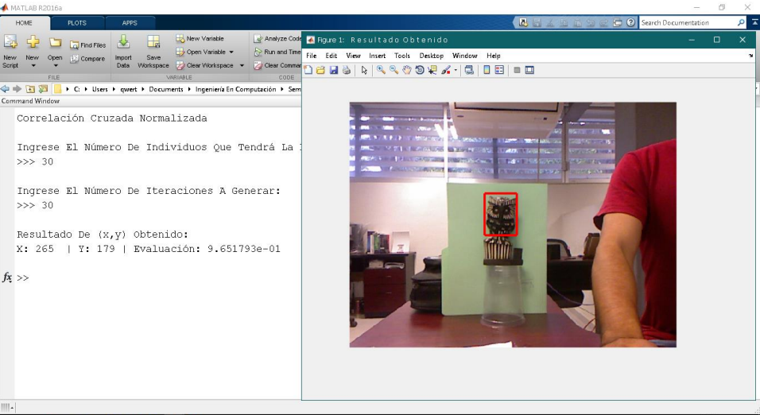
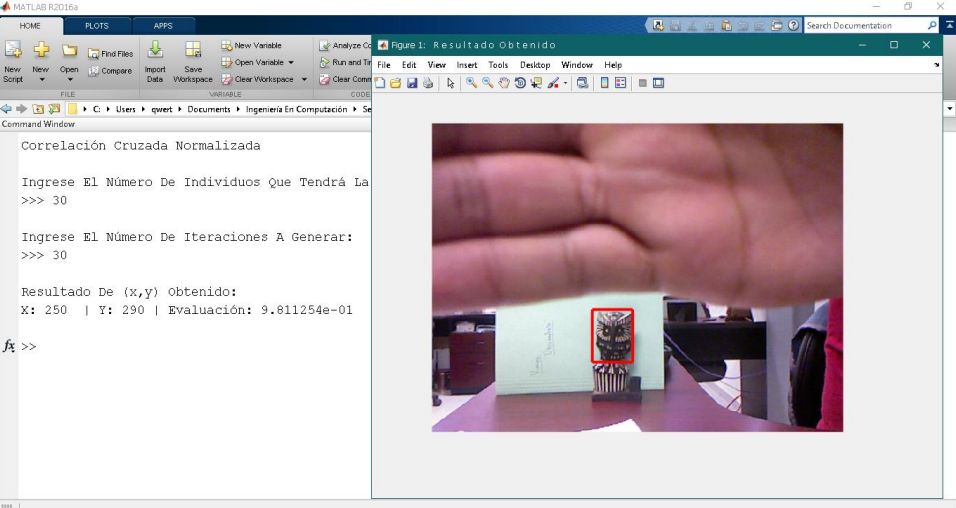
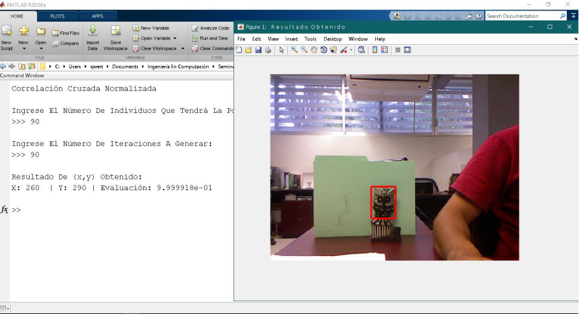

# NCC
Repository with resolution of the normalized cross-correlation applied in the search for matches in images applying its solution by means of evolutionary algorithms, specifically using the hybrid Evolutionary Pollination algorithm (mix of the Flower Pollination and Differential Evolution algorithms).

## Screenshoots

